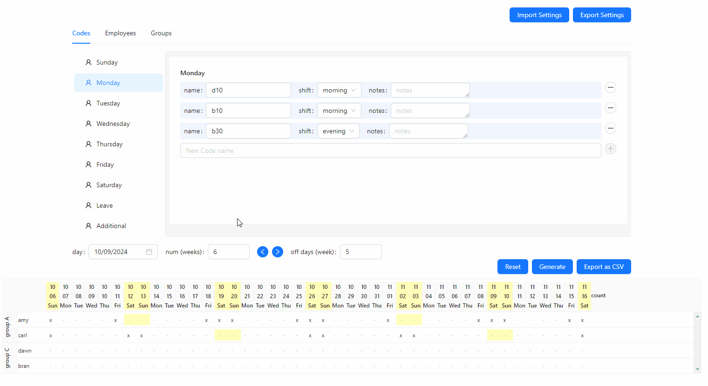
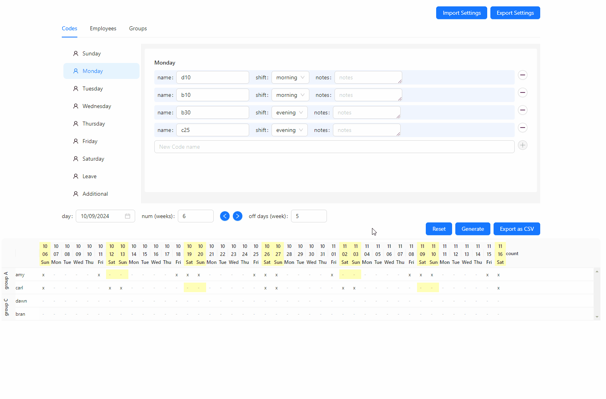
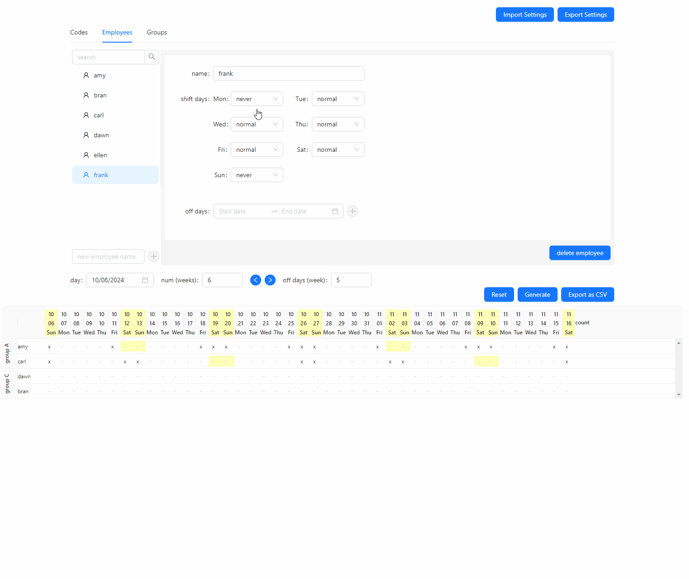
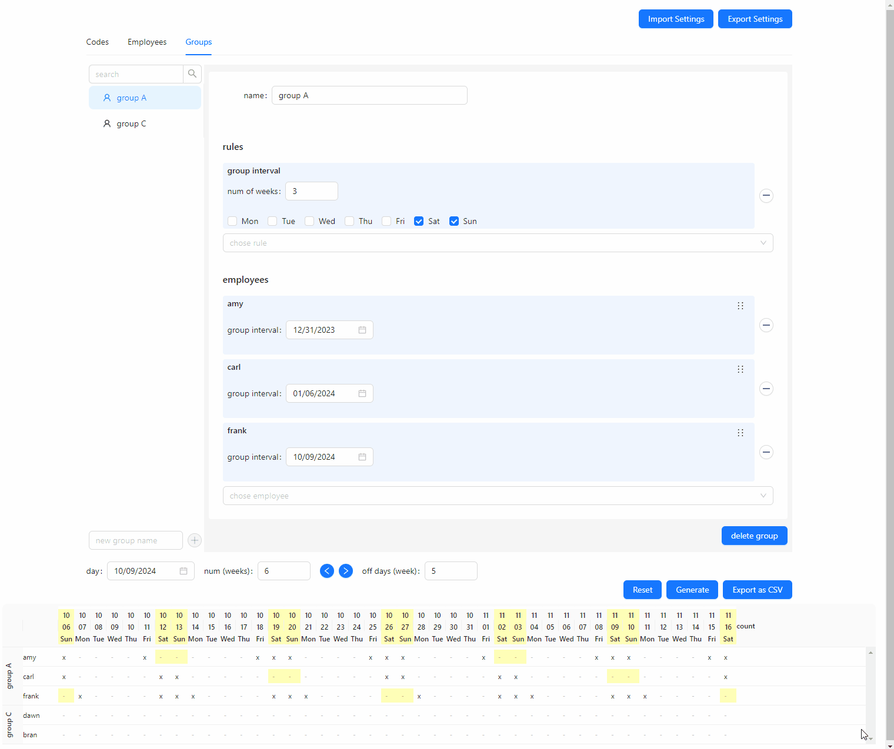
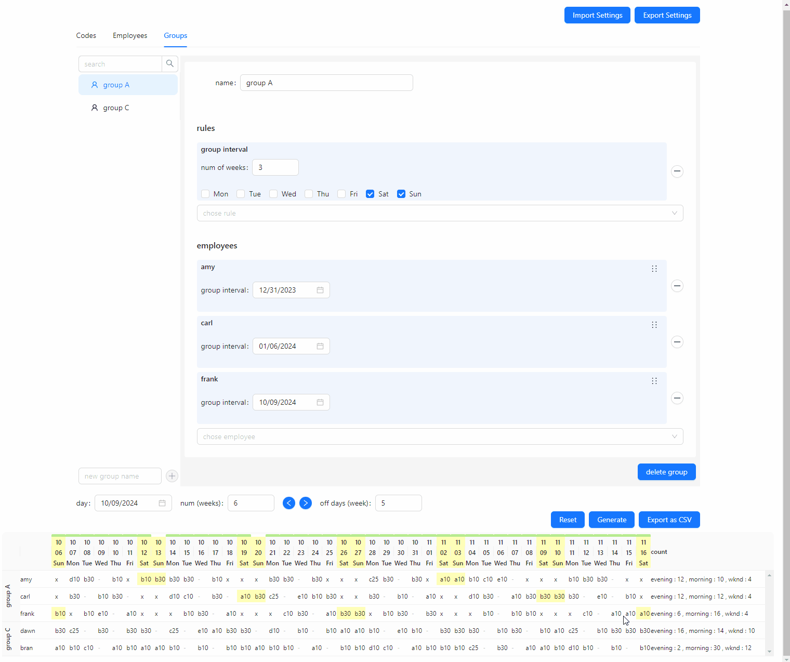
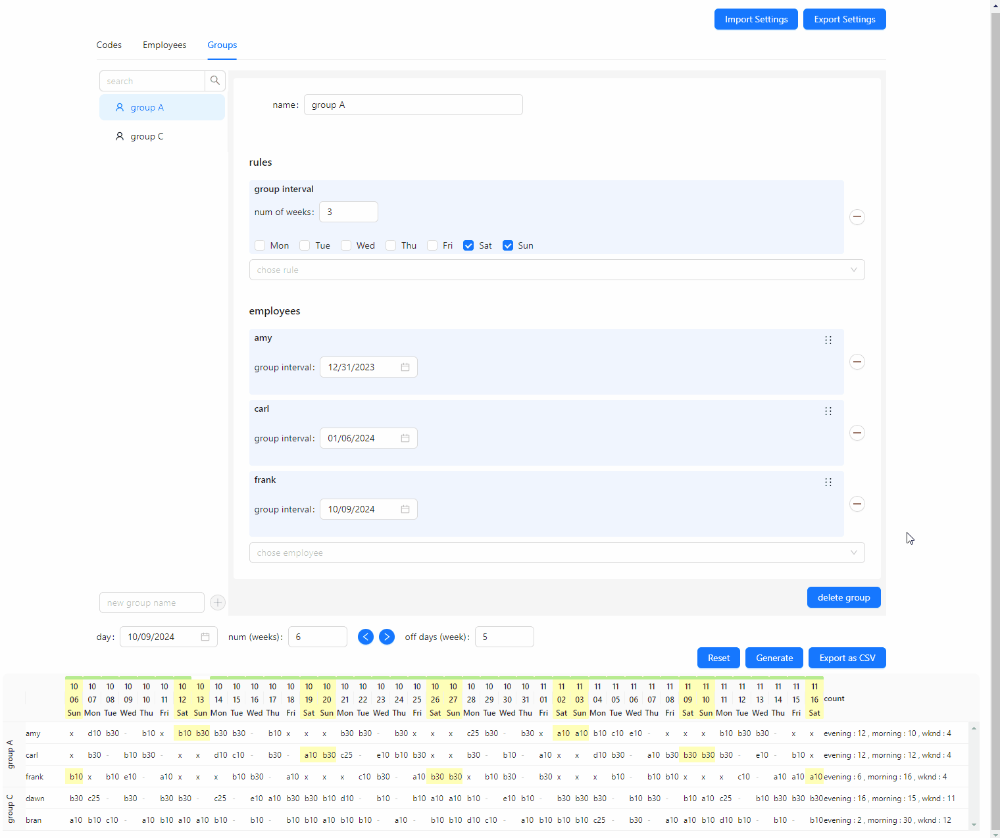

## Scheduler

Scheduler is a front-end website that helps users generate customizable employee schedules. Users add roles that need to be filled each day, add their employees, and then add the employees to different groups with customizable rules. At that point, a schedule can be generated, updated, and exported.

Scheduler came about when a friend who is a pharmacist manager expressed the difficulty and time-consuming nature of creating a schedule for 50 employees every 6 weeks. Solutions that they had previously used did not cover their department's unique use case, hence the idea of a customizable generator, as it could also help other departments with their own unique use cases.

**Tech Stack: **React.js, AntD, dnd-kit

### Demo

1. Adding new codes for the day

2. Adding new employee

3. Adding employee to group

4. Generate schedule

5. Update schedule

6. Drag and Drop

